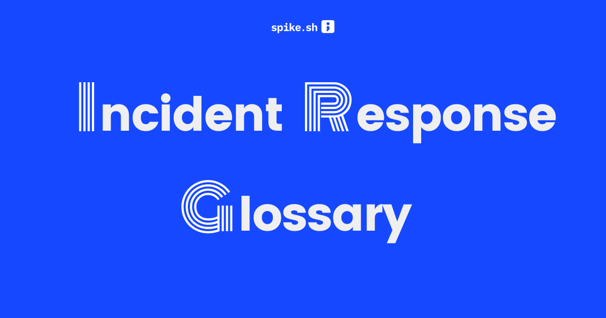

# Incident Response Glossary

This is the largest Incident Response Glossary with 500+ terms explained. We built this glossary because we often found ourselves explaining the same terms to new teammates, and we wanted a single source of truth for anyone working in ops.

Demo → [spike.sh/glossary](https://spike.sh/glossary)

Want to suggest a new term or improve existing ones? See [CONTRIBUTING.md](CONTRIBUTING.md)

## Features

- Responsive design
- Markdown support for term definitions
- Alphabetical filtering of glossary terms
- Easy to add new terms through markdown files

---

## Getting Started

### Prerequisites

- Node.js (v18 or higher)
- npm or yarn

### Installation

1. Clone this repository
2. Install dependencies with `npm install` or `yarn`

### Development

Start the development server with automatic Sass compilation when files change:

```bash
npm run dev
```
```bash
yarn run dev
```

Or you can run Sass compilation and the development server separately:

```bash
npm run sass        # Compile Sass to CSS once
npm run sass:watch  # Watch Sass files for changes and compile automatically
npm start           # Start the 11ty development server
```

The site will be available at [http://localhost:8080](http://localhost:8080).

### Build for Production

Build the site for production:

```bash
npm run sass && npm run build
```

The built site will be in the `_site` directory.

## Project Structure

```
.
├── src/                    # Source files
│   ├── _includes/          # Templates and partials
│   │   └── layouts/        # Layout templates
│   ├── assets/             # Static assets
│   │   ├── css/            # Compiled CSS (don't edit directly)
│   │   ├── js/             # JavaScript files
│   │   ├── images/         # Image assets
│   │   └── scss/           # Sass source files
│   │       ├── base/       # Base styles, variables, reset
│   │       ├── components/ # Component-specific styles
│   │       └── layout/     # Layout styles
│   ├── data/               # Global data files
│   ├──            # +++  Glossary term markdown files   +++
│   ├── index.hbs           # Home page
│   └── glossary.hbs        # Glossary list page
├── .eleventy.js            # Eleventy configuration
├── package.json            # Dependencies and scripts
└── README.md               # This file
```

## Customization

- **Styling**: Edit the Sass files in `src/assets/scss/` directory:
  - `base/_variables.scss`: Color variables, breakpoints, etc.
  - `components/`: Component-specific styles
  - `layout/`: Layout styles
- **Layouts**: Modify templates in `src/_includes/layouts/`
- **Global Data**: Update site-wide data in `src/data/site.js`
- **Configuration**: Adjust settings in `.eleventy.js`


## Alphabetical Filtering

The glossary page includes alphabetical filtering that allows users to filter terms by their first letter. This is implemented with JavaScript in `src/assets/js/glossary.js`.

## Responsive Design

The site is fully responsive and works well on mobile, tablet, and desktop devices.

## Markdown Support

All glossary terms are written in Markdown, which allows for rich formatting including:

- Headings
- Lists
- Bold and italic text
- Links
- Code blocks
- Images

This makes it easy to create structured and well-formatted glossary entries.

# Thank You 🙏
Thanks for checking out the Incident Response Glossary!

This project is a small way for us at Spike.sh to give back to the DevOps and SRE community.

If you find it useful, feel free to share it, contribute, or just explore and learn.

Every term helps someone build more reliable systems — and that’s what we’re here for.

Happy learning!