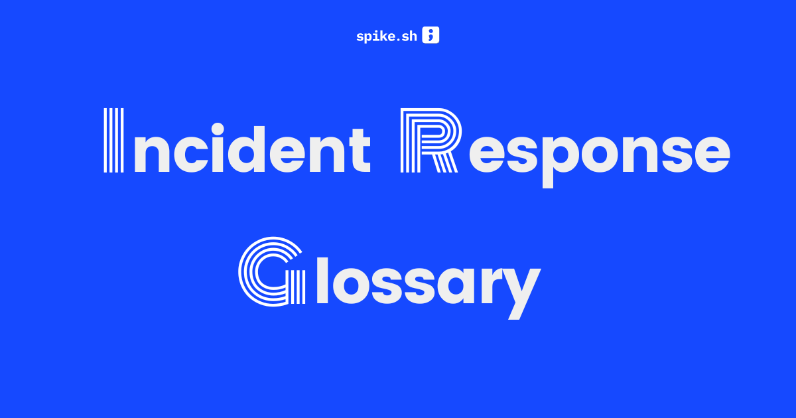

# Incident Response Glossary

This is the largest Incident Response Glossary with 500+ terms explained. We built this glossary because we often found ourselves explaining the same terms to new teammates, and we wanted a single source of truth for anyone working in ops.

Demo → [spike.sh/glossary](https://spike.sh/glossary)

> **PRs are welcome!** Whether you want to contribute new terms or improve the website itself, we welcome content writers and developers alike.

---

## Table of Contents
- [Contributing a New Term ✍️](#contributing-a-new-term)
- [Developer Setup](#developer-setup)
- [How the site is built](#how-the-site-is-built)
- [Keyboard shortcuts](#keyboard-shortcuts)
- [Design system](#design-system)
- [Performance & accessibility](#performance--accessibility)
- [Thank You](#thank-you)

---

## Contributing a New Term

To contribute a term or suggest improvements to existing ones, please see our full guide in [CONTRIBUTING.md](CONTRIBUTING.md).

Here's a quick overview:

1. Go to `/src/` and add a new markdown file (e.g., `incident-management.md`)
2. Use this format:

```markdown
---
term: Incident Management
excerpt: Coordinating efforts to handle and resolve incidents efficiently.
---

## What Is Incident Management
Explain the term...

## Why Is Incident Management Important
Explain why it matters...

## Example Of Incident Management
Give a practical example...
```

3. Commit your file and open a pull request to `production` branch. That's it!

The `excerpt` does real work: it's the page's lede, its meta description, and the
summary on the A–Z index. Keep it to one or two sentences.

---

## Developer setup

### Prerequisites

- Node.js 18 or newer
- Chrome (only for `npm run lighthouse` / `smoke` / `screenshots`)

### Everyday commands

```bash
npm install

npm run dev          # Eleventy dev server with live reload → localhost:8080
npm run build        # production build into _site/ (URLs under spike.sh/glossary)
npm run preview      # local-URL build + a gzipping static server → localhost:8080
```

`npm run dev` and `npm run preview` build with local URLs (`http://localhost:8080`,
no `/glossary` path prefix) so links, canonicals and assets all resolve while you
work. `npm run build` produces the real thing.

### Checks

```bash
npm run preview      # in one terminal
npm run smoke        # drives the keyboard layer in a real browser (30 assertions)
npm run lighthouse   # mobile-profile Lighthouse on the index and a term page
npm run screenshots  # light/dark, phone/desktop captures into reports/
```

### Where things live

```
.
├── brand/
│   ├── spike-theme.css        # shared design tokens — the source of truth
│   └── SPIKE-THEME.md         # the human spec behind them
├── src/
│   ├── *.md                   # +++ the 549 glossary terms +++
│   ├── _includes/
│   │   ├── layouts/base.hbs   # <head>, landmarks, JSON-LD
│   │   ├── layouts/glossary-item.hbs
│   │   ├── site-header.hbs / site-footer.hbs / subscribe.hbs
│   ├── assets/
│   │   ├── css/glossary.css   # all page styles (inlined at build)
│   │   ├── js/glossary.js     # the keyboard layer (deferred, ~3 KB)
│   │   └── images/
│   ├── data/site.js           # origin + path prefix, links, copy
│   ├── data/eleventyComputed.js  # per-page title / description / canonical
│   ├── index.hbs              # the A–Z index
│   ├── sitemap.xml.hbs
│   ├── terms.json.hbs         # term list for the ⌘K palette
│   └── site.webmanifest.hbs
├── scripts/                   # serve, smoke, lighthouse, screenshots
└── .eleventy.js               # collections, helpers, CSS/JS/font pipeline
```

---

## How the site is built

**Eleventy 3 + Handlebars, prerendered to static HTML.** No client framework, no
hydration — every page is complete before a single byte of JavaScript runs.

The build does four things beyond rendering markdown:

- **CSS** — `brand/spike-theme.css` and `src/assets/css/glossary.css` are
  concatenated, minified with esbuild, and **inlined into every page**. The whole
  sheet is ~27 KB (about 6 KB over the wire), which is cheaper than a round trip,
  so pages have *zero* render-blocking requests.
- **Fonts** — Inter, Instrument Sans and Geist Mono are self-hosted variable
  woff2 (`@fontsource-variable`), **subset at build time to the ~125 characters
  the rendered site actually uses** and clamped to the weight ranges the design
  uses. That takes Inter from 48 KB to 22 KB. Both above-the-fold faces are
  preloaded and all of them `font-display: swap`.
- **JS** — one esbuild bundle, ~3 KB gzipped, loaded `defer`.
- **Sitemap, `terms.json` and the web manifest** are Eleventy templates, so they
  inherit the same base URL as everything else.

### URLs

Pages are written to the output root (`_site/acknowledge/index.html`) but the site
is *served* from `https://spike.sh/glossary/`. Every absolute URL and internal
link is derived from `src/data/site.js` rather than hardcoded:

| | `origin` | `base` |
|---|---|---|
| `npm run build` | `https://spike.sh` | `/glossary` |
| `npm run dev` / `preview` | `http://localhost:8080` | *(empty)* |

Override with `SITE_ORIGIN` / `SITE_BASE` if it ever moves.

---

## Keyboard shortcuts

The glossary is browsable end to end without a mouse. Every shortcut is also
printed on screen, and everything reachable by mouse is reachable by keyboard.

The legend sits directly under the A–Z row, next to the nav it drives (and out
of the way on touch, where it means nothing).

| Key | On the index | On a term page |
|---|---|---|
| `/` or `⌘K` / `Ctrl+K` | focus the filter | open the command palette |
| `↑` `↓` | move the active term | move within the palette |
| `Enter` | open the active term | open the selected result |
| `Home` / `End` | first / last term | — |
| `←` `→` | — | previous / next term |
| `Esc` | clear the filter | close the palette |
| `Tab` | everything, in reading order | everything, in reading order |

The whole layer is progressive enhancement. Without JavaScript the index still
renders all 549 terms with working A–Z jump links; the filter box hides itself
rather than sitting there dead.

`/?q=alert` pre-filters the index — which is also what the `SearchAction` in the
page's structured data points at.

---

## Design system

Everything visual comes from [`brand/SPIKE-THEME.md`](brand/SPIKE-THEME.md) and its
token file. The rules that shape this site:

- **Card on canvas.** A warm off-white canvas (`--background`) with white cards
  floating on it — every term is a card, and so is the A–Z toolbar. The index
  hero is the one exception: a full-bleed tinted panel, matching the marketing
  site.
- **Spike Blue is deliberate.** `#134ED9` carries the wordmark, the hero
  headline, the outlined "Get started" button and inline links. Every other
  control is neutral (`--primary`); nothing else is painted blue.
- **Instrument Sans** for headings, **Inter** for body, **Geist Mono** for code.
- **Full dark mode** via a `.dark` class, resolved before first paint by a tiny
  inline script so there's no flash and no layout shift. The toggle remembers your
  choice; without one, the system preference wins.
- **~120 ms hovers**, and all motion gated behind `prefers-reduced-motion`.
- The shared status/priority tone palette ships as `.pill` for definitions that
  need it. Colour is never the only signal — a pill always carries its label.

The header mirrors the marketing site: mono wordmark, product nav, and
Changelog / Get started / Login. Below `lg` the product nav collapses out rather
than into a hamburger — swap in the real component when it lands.

Two deliberate deviations, both marked in `glossary.css`: in light mode
`--muted-foreground` and `--ring` are darkened, because at their shared values they
land at 3.3:1 and 1.9:1 on a white card — below WCAG AA for body text and focus
indicators. Both are worth fixing upstream in `spike-theme.css`.

---

## Performance & accessibility

Lighthouse, mobile profile, production build served locally with gzip
(`npm run preview` + `npm run lighthouse`):

| | Performance | Accessibility | Best Practices | SEO |
|---|---|---|---|---|
| Index (549 terms) | **99–100** | **100** | **100** | **100** |
| Term page | **100** | **100** | **100** | **100** |

Typical index metrics: FCP ~1.3 s, LCP ~1.5 s, TBT 30–50 ms, **CLS 0**.
See [`reports/lighthouse-summary.md`](reports/lighthouse-summary.md).

What gets it there:

- Static HTML, inlined CSS, one small deferred script.
- Subset, preloaded, self-hosted fonts (this was worth ~700 ms of LCP and most of
  the blocking time on the index).
- `content-visibility` on every letter section and every card, with exact
  `contain-intrinsic-size` placeholders — so 549 cards cost almost nothing to lay
  out, the scroll height never lurches, and A–Z anchors land where they should.
- On phones the index is a directory: term names only, in fixed-height rows. The
  summaries stay in the HTML for search engines and appear again from `sm` up.
- A CSS-only hero gradient — no image to download, nothing to shift when it lands.
- Semantic landmarks and headings, one `<h1>` per page, 48px touch targets,
  focus-visible rings that are never suppressed, and a live region that reports
  filter results.
- Per-page `<title>`, meta description, canonical, Open Graph and Twitter tags;
  `DefinedTermSet` + `DefinedTerm` JSON-LD; breadcrumbs; a generated sitemap.

Reports and screenshots land in `reports/`.

---

# Thank You 🙏
Thanks for checking out the Incident Response Glossary!

This project is a small way for us at [Spike](https://spike.sh) to give back to the DevOps and SRE community.

If you find it useful, feel free to share it, contribute, or just explore and learn.

Every term helps someone build more reliable systems — and that's what we're here for.

Happy learning!

Follow us for more:

- [Twitter / X](https://twitter.com/SpikedHQ)
- [LinkedIn](https://linkedin.com/company/spike-hq)
- [r/spikesh on Reddit](https://www.reddit.com/r/spikesh)
